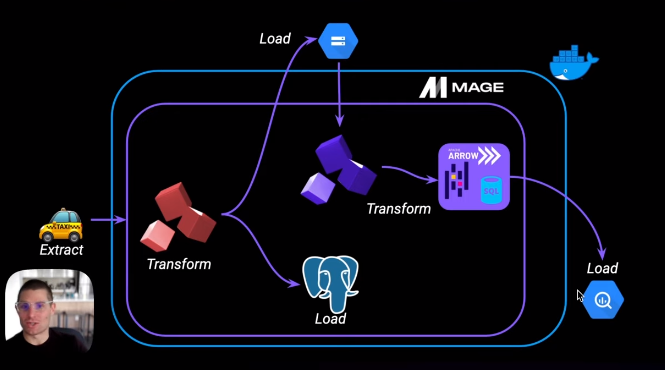

# Datapipeline-Mage-GCP-Postgres


## Table of Contents
1. [Project Overview](#project-overview)
2. [Setup](#setup)
    - [Clone Repository](#clone-repository)
    - [Copy Environment File](#copy-environment-file)
3. [Docker](#docker)
    - [Build Docker Image](#build-docker-image)
    - [Run Docker Container](#run-docker-container)
    - [Note for Docker on Compute Engine](#note-for-docker-on-compute-engine)
4. [API to PostgreSQL](#api-to-postgresql)
    - [Update io_config.yaml](#update-io-configyaml)
    - [Test Connection](#test-connection)
    - [API to PostgreSQL Steps](#api-to-postgresql-steps)
5. [API to GCS](#api-to-gcs)
    - [Create GCP Bucket](#create-gcp-bucket)
    - [Connect Service Account](#connect-service-account)
    - [Test Connection](#test-connection-1)
    - [API to GCS Steps](#api-to-gcs-steps)
6. [GCS to BigQuery](#gcs-to-bigquery)
    - [GCS to BigQuery Steps](#gcs-to-bigquery-steps)
7. [Mage Deployment](#mage-deployment)
    - [Prerequisites](#prerequisites)
    - [Study Backfills and Topics](#study-backfills-and-topics)


### Project Overview:


(Image credit: Matt palmer )

#### 1. **Data Ingestion:**
   - **Source Data:** NYC Taxi dataset.
   - **Ingestion Methods:**
     - **CSV in Postgres:** Raw data is ingested into a local Postgres database using CSV files.
     - **Parquet in GCS:** Data is transformed into the Parquet format and loaded into Google Cloud Storage (GCS) for efficient storage and processing.
     - **Partitioned Parquet in GCS:** Partitioned Parquet files in GCS for optimized data storage and retrieval.
     - **Incremental Data Load in GCS:** Mage orchestrates the incremental data load process in GCS for efficient updates.

#### 2. **Data Transformation:**
   - **Tool Used:** PyArrow is employed for data transformation, handling Parquet efficiently.

#### 3. **Workflow Orchestration:**
   - **Framework Used:** Mage is utilized for orchestrating the entire data workflow.
   - **Containerization:** Mage runs within a Docker container for portability and consistency.

#### 4. **Cloud Integration:**
   - **Google Cloud Platform (GCP):**
     - Data is seamlessly moved from local storage to GCS, leveraging cloud storage capabilities.
     - Loading data from GCS to BigQuery for analysis and reporting.

#### 5. **Data Storage:**
   - **Postgres Database:**
     - Local Postgres database for storing raw data and enabling quick queries.
   - **Google Cloud Storage (GCS):**
     - Efficient storage of Parquet files, both in standard and partitioned formats.

#### 6. **Workflow Steps:**
   - **API to Postgres:** Initial data load from API to local Postgres database.
   - **API to GCS:** Extraction, transformation, and loading of data from API to GCS in both standard and partitioned Parquet formats.
   - **GCS to BigQuery:** Data migration from GCS to BigQuery for further analysis and reporting.

#### 7. **Technology Stack:**
   - **Mage:** Orchestrating the entire data pipeline.
   - **Docker:** Containerization for consistent deployment and execution of Mage.
   - **PyArrow:** Handling Parquet data efficiently during the transformation process.
   - **Postgres:** Local database for quick data storage and retrieval.
   - **Google Cloud Storage (GCS):** Cloud-based storage for efficient data handling.
   - **BigQuery:** Google's serverless data warehouse for analytics.

#### 8. **Future Considerations:**
   - **Parameterized Execution:** Mage allows for parameterized execution, enabling flexibility in handling varying data scenarios.
   - **Optional Deployment:** Optional deployment using Terraform and Google Cloud for those interested in a fully deployed project.

This architecture provides a robust and scalable framework for ingesting, transforming, and analyzing data from the NYC Taxi dataset, showcasing the capabilities of Mage in orchestrating complex data workflows.

## Setup

1. Clone the repository:

   ```bash
   git clone {githubrepo}
   cd {githubrepo}
   ```

2. Copy the `devenv` file to `.env`:

   ```bash
   cp devenv .env
   ```

## Docker

3. Build Docker image:

   ```bash
   docker compose -f docker-compose.yml build
   ```

4. Run the Docker container:

   ```bash
   docker compose -f docker-compose.yml up
   ```

   **Note:** If running Docker on Compute Engine, add the user to the Docker group:

   ```bash
   sudo usermod -aG docker $USER
   ```

   Then use `docker compose`, or use `sudo docker compose -f docker-compose.yml build` (not recommended).

## API to PostgreSQL

5. Update the `io_config.yaml` file with your `.env` credentials:

   ```yaml
   dev:
     # PostgreSQL
     POSTGRES_CONNECT_TIMEOUT: 10
     POSTGRES_DBNAME: "{{ env_var('POSTGRES_DBNAME') }}"
     POSTGRES_SCHEMA: "{{ env_var('POSTGRES_SCHEMA') }}" # Optional
     POSTGRES_USER: "{{ env_var('POSTGRES_USER') }}"
     POSTGRES_PASSWORD: "{{ env_var('POSTGRES_PASSWORD') }}"
     POSTGRES_HOST: "{{ env_var('POSTGRES_HOST') }}"
     POSTGRES_PORT: "{{ env_var('POSTGRES_PORT') }}"
   ```

   Test the connection using a simple `test_block`.

6. Follow the steps in [api_to_postgres.md](./API_to_POSTGRES/api_to_postgres.md) file in [API_to_POSTGRES](./API_to_POSTGRES/) folder.

## API to GCS

7. Create a GCP bucket to load data.

8. Connect your service account to `mage io_config.yaml` file:

   ```yaml
   GOOGLE_SERVICE_ACC_KEY_FILEPATH: "home/src/google-cred.json"
   ```

   Test the connection in the `test_block`.

9. Follow the steps in [api_to_gcs.md](./API_to_GCS/api_to_GCS.md) file in [API_to_GCS](./API_to_GCS) folder.


## GCS to BigQuery

10. Follow the steps in [gcs_to_bigquery.md](./GCS_to_Bigquery/gcs_to_bigquery.md) file in [GCS_to_bigquery](./GCS_to_bigquery) folder.


## Mage Deployment

11. Ensure the following prerequisites are met:
    - Terraform: [Install Terraform](https://www.terraform.io/downloads.html)
    - Google Cloud CLI: [Install Google Cloud CLI](https://cloud.google.com/sdk/docs/install)
    - Google Cloud Permissions:
        - Artifact Registry Reader
        - Artifact Registry Writer
        - Cloud Run Developer
        - Cloud SQL Admin
        - Service Account Token Creator
    - Mage Terraform Templates

12. Study backfills and other relevant topics.
